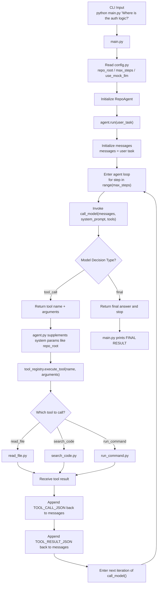
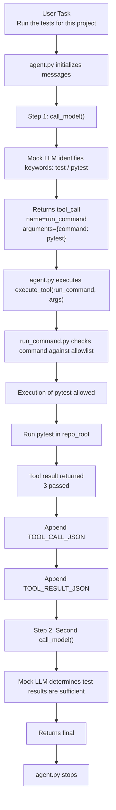

# Day 3 Notes

## What I completed today

Today I connected the tool layer from Day 2 to a minimal working agent loop.

I implemented three core pieces:

- a minimal `call_model()` interface
- the first working version of `agent.py`
- a simple way to append tool results back into `messages`

By the end of the day, I was able to run the repo agent on simple natural-language tasks and observe multi-step behavior before it returned a final answer.

---

## What I built

### 1. A minimal `call_model()` contract

I designed `call_model()` so that it returns only one of two response types:

**Tool call**
- type: `tool_call`
- name: tool name
- arguments: dictionary of tool arguments

**Final answer**
- type: `final`
- content: final response text

This was an important design choice because it keeps the agent loop simple, explicit, and easy to debug.

### 2. A minimal agent loop in `agent.py`

The loop now works like this:

1. Start with the user task
2. Call the model
3. If the model asks for a tool, execute it
4. Append the tool result back into `messages`
5. Call the model again
6. Stop when the model returns a final answer or when max steps is reached

### 3. Tool result feedback into `messages`

I explicitly add both of these back into the conversation history:

- the tool call chosen by the model
- the tool result produced by Python code

This gives the next model step enough information to continue reasoning.

---

## What I tested

### Task 1
**User task:**  
Where is the auth logic in this repo?

**Observed behavior:**
- Step 1: `search_code("verify_token")`
- Step 2: `read_file("auth.py")`
- Step 3: final answer

This showed that the agent can search first, inspect the relevant file next, and then stop. :contentReference[oaicite:1]{index=1}

### Task 2
**User task:**  
Find the README in this repo

**Observed behavior:**
- Step 1: `read_file("README.md")`
- Step 2: final answer

This showed that the agent does not always need search first. It can go directly to reading a file when the task is simple. :contentReference[oaicite:2]{index=2}

### Task 3
**User task:**  
Run the tests for this project

**Observed behavior:**
- Step 1: `run_command("pytest")`
- Step 2: final answer

This showed that the agent can route to command execution when needed, and that the safe command path is working. The test run completed successfully with 3 passing tests. :contentReference[oaicite:3]{index=3}

---

## What I learned today

### 1. The core of an agent is the loop, not the model

The most important thing I built today was not “intelligence,” but the control flow:

- decision
- execution
- observation
- continuation

That is the real engine of the agent.

### 2. Fixed output contracts make the system easier to debug

By forcing `call_model()` to return only `tool_call` or `final`, I reduced ambiguity and made the loop much easier to reason about.

### 3. Tool result injection is essential

If the tool result is not written back into `messages`, the model has no real state progression. It would behave as if the tool had never been run.

### 4. Mock mode was a good choice for this stage

Using a mock model response first helped me validate the architecture before dealing with real provider SDK details.

---

## What is working now

The repo agent can now:

- accept a natural-language task
- choose a tool
- execute the tool
- receive the observation
- continue to the next step
- stop within a bounded number of steps

This means I now have a real minimal agent loop, not just a collection of tools.

---

## What still needs improvement

### 1. Final answers are still too generic

Right now, the final answers are mostly placeholder summaries. They confirm that the loop works, but they do not yet synthesize the tool outputs in a grounded and detailed way.

### 2. Logging is still basic

I can see the steps in the terminal, but I still need a more systematic step logger.

### 3. Real provider integration is still pending

The architecture is now working, but I have not yet fully connected it to a real model provider in a production-style way.

---

## Plan for Day 4

Tomorrow I want to focus on observability and debuggability.

Main goals:
1. add a step logger
2. make the loop easier to inspect
3. improve final answer generation so it actually uses tool results
4. prepare the project for a cleaner transition to real model calls later

---

## Summary

Day 3 was the first day the project started to feel like a real agent system.

Before today, I had tools.

After today, I have a working loop.

It is still minimal, but the architecture is now real:

model decision → tool execution → observation → next decision

### 例子展示：Where is the auth logic in this repo?

```mermaid
flowchart TD
    A["User Task<br/>Where is the auth logic in this repo?"] --> B["main.py passes task to RepoAgent.run()"]
    B --> C["agent.py initializes messages"]
    C --> D["messages contains only the user task"]

    D --> E["Step 1: call_model()"]
    E --> F["Mock LLM detects keywords: auth / verify_token"]
    F --> G["Returns tool_call<br/>name=search_code<br/>arguments={query: verify_token}"]

    G --> H["agent.py executes execute_tool(search_code, args)"]
    H --> I["search_code.py runs: rg -n verify_token repo_root"]
    I --> J["Tool result returned<br/>matches found in app.py / test_auth.py / auth.py"]

    J --> K["agent.py appends TOOL_CALL_JSON to messages"]
    K --> L["agent.py appends TOOL_RESULT_JSON to messages"]

    L --> M["Step 2: Second call_model()"]
    M --> N["Mock LLM sees auth.py in recent tool_result"]
    N --> O["Returns tool_call<br/>name=read_file<br/>arguments={path: auth.py}"]

    O --> P["agent.py executes execute_tool(read_file, args)"]
    P --> Q["read_file.py reads auth.py lines 1-7"]
    Q --> R["Tool result returned<br/>contains verify_token(token) implementation"]

    R --> S["Append TOOL_CALL_JSON to messages again"]
    S --> T["Append TOOL_RESULT_JSON to messages again"]

    T --> U["Step 3: Third call_model()"]
    U --> V["Mock LLM determines info is sufficient"]
    V --> W["Returns final"]
    W --> X["agent.py stops loop"]
    X --> Y["main.py prints FINAL RESULT"]
```

第二个真实例子：Run the tests for this project

