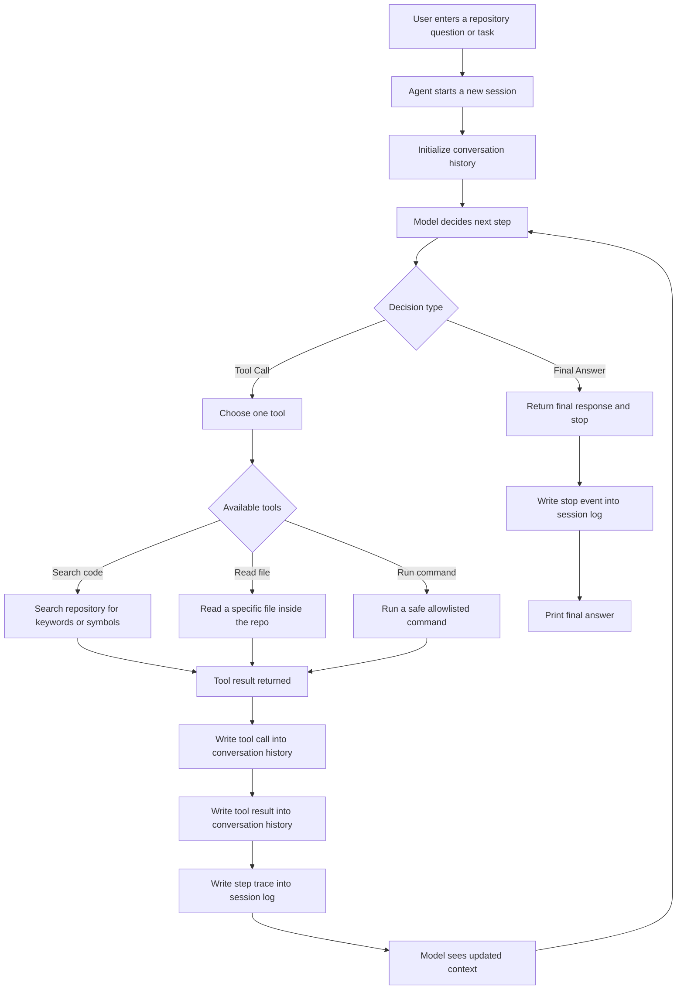

# Day 4 Notes

## What I completed today

Today I focused on making the repo agent easier to inspect and making its final answers more grounded.

I worked on three main improvements:

- added a step logger that writes execution traces into `logs/`
- improved grounded final answer generation
- fixed the README summary and logger session file naming

By the end of the day, the agent was still stable, but the outputs became more useful and easier to debug.

---

## What I improved

### 1. Added session-based step logging

I implemented a local JSONL logger that records each run into a separate file under `logs/`.

Each session now gets its own unique log file name, including:
- timestamp
- microseconds
- short UUID suffix

This prevents multiple runs from being mixed into the same file.

### 2. Improved grounded final answers

Previously, the final answers were too generic, such as:
- "I inspected the file..."
- "I ran the command..."

Now the final answers use the latest tool result more directly.

For example:
- for `auth.py`, the agent now explains what the key function does
- for `README.md`, the agent now gives a cleaner summary of the heading and description
- for `pytest`, the agent still reports the number of tests collected and passed

### 3. Cleaned up README summarization

The previous version had duplicated phrasing like:
- "The README is in..."
- "The file is..."

I fixed this so the README answer now sounds more natural and avoids repetition.

---

## What I observed from testing

I tested three main tasks:

### Task 1
**Where is the auth logic in this repo?**

The agent:
1. searched for `verify_token`
2. read `auth.py`
3. produced a more grounded final answer

This showed that the search → inspect → answer path is working well.

### Task 2
**Find the README in this repo**

The agent:
1. read `README.md`
2. produced a cleaner summary

This confirmed that direct file-reading tasks work well without needing a prior search step.

### Task 3
**Run the tests for this project**

The agent:
1. ran `pytest`
2. summarized the result correctly

This confirmed that the command execution path is still stable after the Day 4 changes.

---

## What I learned today

### 1. Observability matters early
Even in a very small agent project, logs make a big difference.
Without them, I would only see terminal output.
With them, I can inspect the sequence of decisions after the run.

### 2. Grounded answers are much better than template answers
A generic final answer proves that the loop works.
A grounded final answer proves that the agent is actually using tool outputs.

### 3. Small formatting improvements matter
The README example showed that even when the information is correct, wording and formatting still affect quality a lot.

### 4. Separate session files are important
Multiple runs should not be mixed into the same log file.
Per-run session files make debugging much easier.

---

## What is working now

At this point, the repo agent can:

- accept a natural-language task
- choose a tool
- execute the tool
- append tool results back into the loop
- produce a grounded final answer
- write a separate session trace for each run

This means the project is no longer just a minimal loop.
It is now a minimal loop with basic observability and improved answer quality.

---

## What is still weak

### 1. Read-file summarization can still improve
The `auth.py` summary is better now, but it is still rule-based and shallow.

### 2. The system is still using mock decision logic
This is fine for the current stage, but real provider integration is still the next important milestone.

### 3. Benchmarking is not done yet
I now have logs and outputs, but I still do not have a formal evaluation harness.

---

## Plan for Day 5

Next, I want to move from architecture validation toward more realistic model integration.

Main goals for Day 5:
1. connect a real model provider in the simplest possible way
2. preserve the same `tool_call` / `final` contract
3. keep the logger and grounded final-answer logic intact
4. validate that the loop still works outside mock mode

---

## Summary

Day 4 was about making the repo agent more inspectable and more trustworthy.

Before Day 4:
- the loop worked
- the answers were generic
- logs were minimal

After Day 4:
- each run has its own session trace
- final answers are more grounded
- the system is easier to inspect and debug

The project still remains small, but it now feels much more like a real agent prototype.

**Current core idea**

The model does not directly execute tools.  
It decides the next action.

The program executes the selected tool, writes the result back into the conversation history, records the step into a session log, and then lets the model continue from the updated context.

This creates a controlled loop:

**decision → execution → observation → next decision**