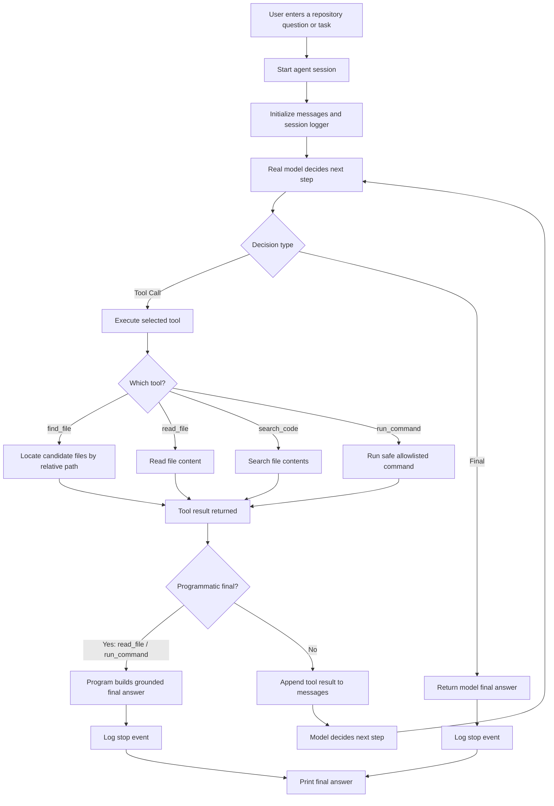

# Day 5 Notes

## What I completed today

Today I moved the repo agent from mock-only decision logic to a real OpenAI-based decision path while keeping the overall architecture stable.

The most important result was not just calling a real model API.  
The more important result was that the system still behaved like a controlled agent after the model became real.

By the end of Day 5, the agent could:

- use a real OpenAI model for tool selection
- recover from a malformed tool-call JSON format with parser fallback
- use a new `find_file` tool to locate candidate files before reading them
- use programmatic finalization for selected tools
- produce stable multi-step paths such as:
  - `find_file -> read_file -> final`
  - `run_command -> final`

---

## Why Day 5 mattered

Before Day 5, the project mainly validated the architecture in mock mode.

That was useful, but mock behavior was still heavily shaped by handwritten logic.

Day 5 answered a more important question:

**Can the agent architecture still hold when the model is real and less predictable?**

The answer is yes.

The real model did not always behave exactly like the mock version, but after improving tool design, prompt guidance, parser fallback, and final-answer control, the system became much more robust.

---

## Main improvements

### 1. Real OpenAI model integration

I connected the agent to a real OpenAI model while preserving the same upper-layer contract.

The model is still expected to produce one of two output types:

- `tool_call`
- `final`

This was an important design choice because it allowed me to reuse almost all of the existing architecture from earlier days.

I did **not** switch to native function calling yet.  
Instead, I kept the JSON-text protocol so the migration stayed small and debuggable.

---

### 2. Added the `find_file` tool

I added a new repository tool called `find_file(pattern, repo_root)`.

This tool was created to solve a weakness that appeared during real-model testing:

- `search_code` is good for searching **file contents**
- but it is not ideal for locating a file by **file name or relative path**

The new `find_file` tool is now responsible for file-level discovery.

Its current implementation supports:

- defensive input validation
- invalid `repo_root` handling
- relative-path matching
- ignored noisy directories such as:
  - `.pytest_cache`
  - `.git`
  - `__pycache__`
  - `.venv`
- case-insensitive matching
- sorted and truncated output
- structured result schema

This tool improved both README-style tasks and logic-location tasks.

---

### 3. Improved tool guidance in the prompt

I updated the prompt so the intended workflow became clearer.

The main guidance added was:

- use `find_file` to locate files by name or path keyword
- use `read_file` after `find_file` when the task requires understanding file contents, logic, definitions, or documentation
- do not stop too early after only locating a file

This made the real model much more likely to follow the intended path:

**locate first, inspect second, answer last**

---

### 4. Added parser fallback for malformed tool JSON

A real model sometimes produced an almost-correct tool response with the wrong schema.

For example, instead of returning:

```json
{
  "type": "tool_call",
  "name": "read_file",
  "arguments": {
    "path": "README.md"
  }
}
```

it could return:

```json
{
  "type": "read_file",
  "arguments": {
    "path": "README.md"
  }
}
```

The intent is correct, but the format is wrong.

To make the system more robust, I added a parser fallback:

- if `type` is equal to a known tool name
- automatically rewrite it into a standard `tool_call`

This small change made the real-model loop much more reliable without changing the overall architecture.

---

### 5. Programmatic finalization for selected tools

I decided to use a more controlled final-answer strategy.

Instead of always letting the model write the final answer freely, I now use **programmatic finalization** for these tools:

- `read_file`
- `run_command`

This means:

- the real model still decides how to navigate the repository
- but once strong enough evidence is available from `read_file` or `run_command`, the program itself generates the final answer using grounded summarization

This gives me:

- more stable final answers
- easier benchmarking
- easier debugging
- better reproducibility

I intentionally did **not** force `find_file` to finalize directly, because it is usually an intermediate step rather than final evidence.

---

## Main design decision from Day 5

### Real model for decisions, program for final expression

This became the most important architecture choice of the day.

The system is now split into two layers.

### Layer 1: model-driven navigation
The real model decides:

- which tool to call next
- how to move through the repository

### Layer 2: program-driven closing
The program decides:

- how to summarize `read_file` results
- how to summarize `run_command` results
- how to produce a stable final answer

This is the main reason the agent now feels both more realistic and more controllable.

---

## What worked well

### README task

The real-model path improved into:

**find_file -> read_file -> programmatic final**

This was a big improvement over earlier behavior, where the model either searched the wrong thing or stopped too early.

### Auth logic task

The model now correctly follows:

**find_file -> read_file -> programmatic final**

instead of stopping at import references or intermediate search results.

### Test task

The model correctly uses:

**run_command("pytest") -> programmatic final**

and the final answer remains stable and benchmark-friendly.

---

## Current workflow



---

## Current implemented functionality

At this point, the repo agent supports the following behavior:

- real OpenAI model integration
- structured tool execution
- session-based logging
- parser fallback for malformed tool-call JSON
- `find_file` for file-level location
- `read_file` for file-content inspection
- `search_code` for content-level search
- `run_command` for safe command execution
- programmatic final answers for:
  - `read_file`
  - `run_command`

This means the project is no longer just a mock learning scaffold.  
It is now a real, minimal, controlled repo-agent prototype.

---

## What is still weak

### 1. Search behavior is still heuristic
The system is better than before, but the model can still choose suboptimal searches in some cases.

### 2. File summarization is still rule-based
The grounded summaries are stable, but they are still relatively shallow and hand-engineered.

### 3. No formal evaluation harness yet
I can inspect logs and examples, but I still do not have a benchmark suite.

### 4. Native tool calling is not used yet
The current JSON-text contract is useful for learning and debugging, but later I may want to compare it with native tool-calling APIs.

---

## What I learned today

### 1. Real models expose tool-design weaknesses
Mock mode mainly validates architecture.  
Real models validate tool semantics and stopping behavior.

### 2. A better tool often matters more than a better prompt
Adding `find_file` improved behavior more than prompt tuning alone.

### 3. Small parser fallbacks are extremely valuable
A tiny normalization step can turn “almost-correct” model output into a successful tool call.

### 4. Stable final answers are worth controlling
Letting the model do all final writing is flexible, but less reproducible.  
Programmatic finalization makes the system much more stable.

---

## Plan for Day 6

Next, I want to continue improving control and evaluation rather than adding too many new features at once.

Possible Day 6 directions:

1. strengthen grounded summaries further
2. add a small benchmark set of repo questions
3. compare real-model traces across tasks
4. refine search vs file-location behavior
5. decide whether to keep the JSON-text protocol or start evaluating native tool calling

---

## Summary

Day 5 was the point where the repo agent became a real-model system rather than a mock-only prototype.

The biggest win was not just connecting OpenAI.  
The real win was proving that the architecture could still work under realistic model behavior.

By the end of the day, I had:

- real model decision-making
- better file-location behavior
- parser robustness
- controlled finalization
- stable multi-step repo-agent paths

This is a strong foundation for the next stage.